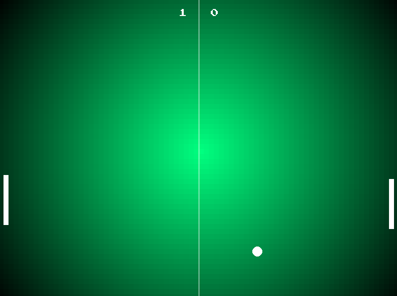

<h1 align="center">Pong Game</h1>

  
  
  
  

A retro-inspired Pong clone built with Python and Pygame — featuring a beatable AI opponent, CRT-style glow, and crisp pixel-perfect visuals.  
Designed to capture the charm of classic arcade gaming while keeping the code modern, minimal, and easy to follow.

---

## 📸 Showcase

  

---

## 🎮 Features

- 🧠 **Beatable AI** — fast but not unbeatable
- 🖥️ **Retro CRT glow** & _Press Start 2P_ pixel font
- 🟩 **"YOU WIN"** / 🟥 **"YOU LOSE"** end screens
- 🎯 **Dynamic ball speed** — faster rallies get intense
- 🏁 **First to 7 points** takes the match
- 🔁 **Instant restart** after game over
- 💾 **Single-file implementation** for easy tweaking

---

## 🕹️ Controls

| Key             | Action                  |
| --------------- | ----------------------- |
| ⬆️ Up Arrow     | Move paddle up          |
| ⬇️ Down Arrow   | Move paddle down        |
| 🔁 R            | Restart after game over |
| 🔴 Close Button | Quit the game           |

> **Note:** Press the window close button (X) to exit — there’s no ESC key binding.

---

## 📦 Installation

1. **Clone the repository**  
   `git clone https://github.com/anshgirap/pong-game.git && cd pong-game`

2. **Install Pygame**  
   `pip install pygame`

3. **Run the game**  
   `python pong.py`
